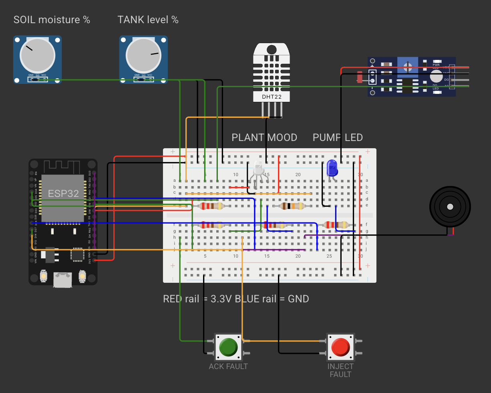
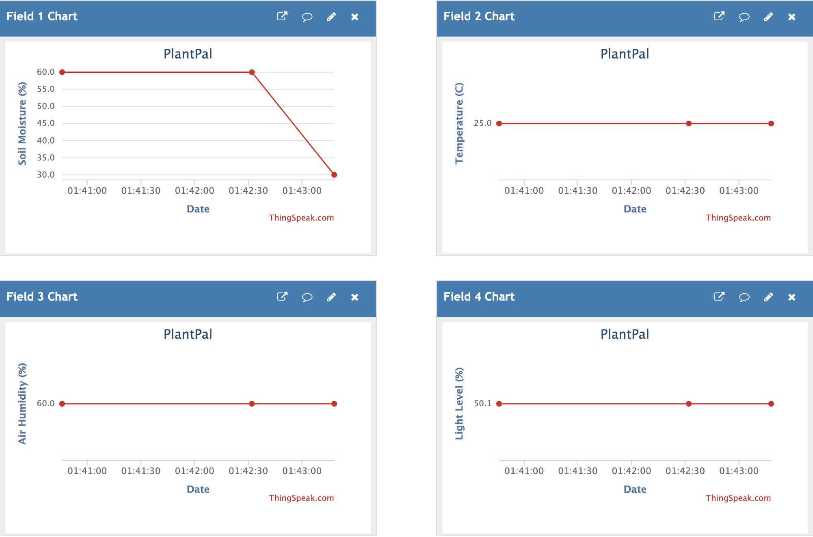
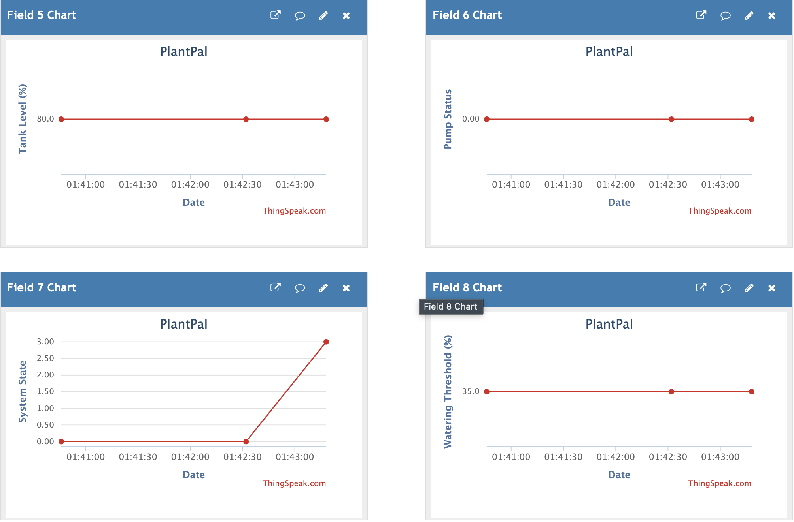

# Screenshot Evidence

These PNG files are unchanged copies of screenshots supplied by the user on October 4, 2026. They contain no visible API key. They document simulated inputs and dashboard results, not physical plant measurements.

## Wokwi circuit

The circuit shows an ESP32, breadboard, soil/tank potentiometers, DHT22, light sensor module, RGB status LED, pump indicator LED, buzzer, resistors, and fault buttons. A static image does not independently prove electrical connectivity or state transitions.

## ThingSpeak fields 1-4

Soil moisture changes from 60% to approximately 30%. The displayed temperature, humidity, and relative light remain at 25 degrees Celsius, 60% RH, and 50.1%, respectively.

## ThingSpeak fields 5-8

The displayed values show an 80% tank level, pump OFF at sampled upload times, a state-code change from 0 (HEALTHY) to 3 (SOAKING), and a 35% watering threshold.

## Interpretation limits

- Together with the reported `CLOUD accepted entry=1` message, these charts support successful basic uploading and historical display of all eight fields.
- Upload snapshots can miss a three-second pump pulse; an all-zero pump chart does not prove that the pump never operated.
- State codes are categories. A connecting line does not represent a continuous state value or every intermediate transition.
- Only a few samples are visible. The charts do not establish long-term reliability or exact arrival intervals.
- The operator manually changed the soil input. Wokwi does not simulate the physical water-soil-plant process used here.
